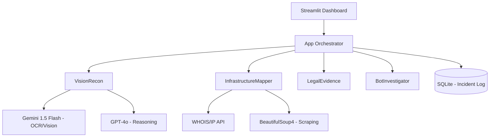

# 🦅 SUNQAR AI | Anti-Scam OSINT System

**SUNQAR AI** — это автономная система разведки на основе открытых источников (OSINT) и искусственного интеллекта, разработанная специально для борьбы с финансовыми пирамидами и интернет-мошенничеством в Республике Казахстан.

Проект создан для хакатона в г. Туркестан при поддержке ДЭР (Департамента экономических расследований).

---

## 🏗 Архитектура системы

SUNQAR AI построен по модульному принципу с четким разделением ответственности. Система использует **Hybrid AI Orchestration**, где разные модели решают задачи своего класса.

### 🧩 Компоненты и модули

#### 👁 Vision Recon (`modules/vision.py`)
Реализует **Two-Stage Analysis**:
1.  **Stage 1 (Perception):** Gemini 1.5 Flash выполняет OCR и поиск визуальных аномалий (дипфейки, логотипы) за счет высокого контекстного окна и скорости.
2.  **Stage 2 (Reasoning):** Результаты парсинга передаются в GPT-4o с системным промптом "Investigator Mode" для вынесения итогового вердикта и сопоставления с УК РК в формате JSON.

#### 🌐 Infrastructure Mapper (`modules/mapper.py`)
Обеспечивает сбор технической доказательной базы:
- **Network Discovery:** Резолвинг IP, поиск открытых портов (nmap integration) и определение регистратора.
- **Content Scraping:** Извлечение текстового слоя, мета-тегов и скрытых идентификаторов (FB Pixel, GA ID) для выявления связей между разными ресурсами одной «скам-сетки».
- **Real-time Extraction:** Предобработка HTML для очистки от "шума" перед отправкой в LLM.

#### ⚖️ Legal Evidence (`modules/legal.py`)
Парсер индикаторов, преобразующий технические находки в юридически значимые формулировки. Содержит базу прецедентов и статей УК РК (190, 217, 307). 
Генерирует рапорт в формате Markdown, готовый к экспорту в PDF/Doc.

#### 🤖 Bot Investigator (`modules/bot_investigator.py`)
Сценарный движок для разбора Telegram-воронок. Имитирует поведение пользователя для прохождения через цепочки ботов и извлечения финальных вредоносных URL, защищенных редиректами.

---

## � Data Flow (Жизненный цикл запроса)

1.  **Ingestion:** Пользователь подает URL или медиа-файл.
2.  **Enrichment:** `InfrastructureMapper` собирает технический след (IP, контент сайта).
3.  **Visual Processing:** `VisionRecon` обрабатывает визуальные триггеры.
4.  **Consolidation:** Все собранные данные (текст сайта + визуальные маркеры + тех. данные) отправляются в GPT-4o для корреляционного анализа.
5.  **Qualifying:** `LegalEvidence` накладывает результат анализа на сетку статей УК РК.
6.  **Persistence:** Инцидент сохраняется в SQLite для анализа «сеток» в будущем.

---

## 🛠 Технологический стек (Deep Dive)

- **Frontend:** Streamlit 1.32+ с кастомными CSS-инъекциями для UI/UX.
- **LLM Orchestration:** `openai`, `google-generativeai`.
- **OSINT Tools:** `python-whois` (парсинг доменов), `python-nmap` (сканирование портов).
- **Environment:** `python-dotenv` для безопасного управления секретами.

---

## 📂 Подробная структура проекта

- `app.py` — Точка входа, управление состоянием Streamlit (Session State).
- `modules/`
  - `vision.py` — Класс `VisionRecon`, управление LLM-запросами.
  - `mapper.py` — Класс `InfrastructureMapper`, логика скрейпинга и сетевых запросов.
  - `legal.py` — Логика маппинга "индикатор -> статья".
  - `bot_investigator.py` — Логика эмуляции взаимодействий.
- `utils/`
  - `db_manager.py` — Слой доступа к данным (DAO) для SQLite.
- `assets/`
  - `style.css` — Определение дизайн-системы (Cyber-Security Theme).

---

## 📦 Установка и запуск (для разработчиков)

## ⚖️ Юридическая часть

Система автоматически сопоставляет найденные улики со статьями:
- **Статья 190 УК РК:** Мошенничество.
- **Статья 217 УК РК:** Создание и руководство финансовой (инвестиционной) пирамидой.
- **Статья 307 УК РК:** Организация незаконного игорного бизнеса.

---

## 🇰🇿 SUNQAR AI — За финансовый суверенитет и безопасность Казахстана!
# sunkar_AI
